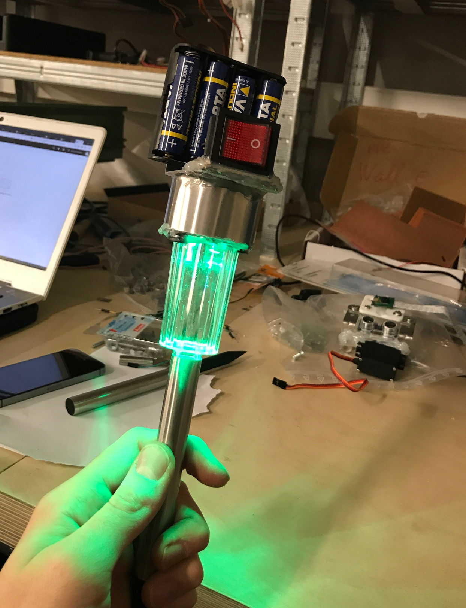

## PleePlee Robot

PleePlee is a proof of concept of a mobile gardener robot.
This repository is about the code for miscellaneous components of the robot.
It contains the code and documentation for:
- the camera
- the LEDs
- the motor driver
- the odometric captors

## Features

The PleePlee robot is able to:
- :seedling: :shower: Water plants.
- :car: Move in a straight line and turn in place.
- :bulb: :satellite: Localize itself in a small area delimited by luminous landmarks.
- :curly_loop: Avoid obstacles.
- :eyes: Log any changes to the garden. (Foreign object or person crossing).

## Components

This repository is about the code used for multiple hardware components on
the robot.
It contains the code and documentation for:
- the camera
- the LEDs
- the motor driver
- the odometric captors
ot.

## Camera

## LEDs

The LEDs are luminous landmarks used as beacon for locating the robot
by triangularisation.

[More on the LEDs](leds/README.md)

## Motor

## Odometry

The optical odometry sensors monitors the number of turns of each wheel.
This allows a greater precision for the robot moves and ease the location.

[More on the Odometry](leds/README.md)
