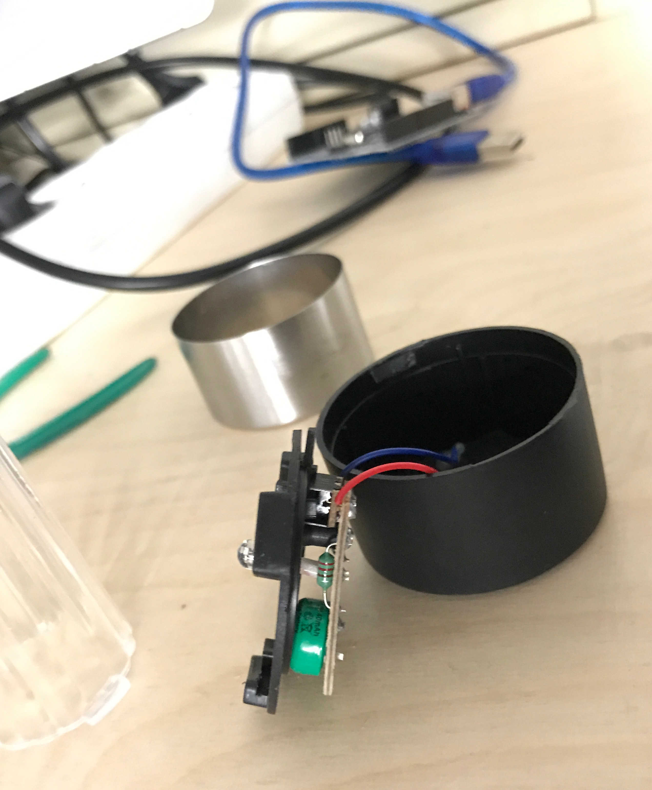
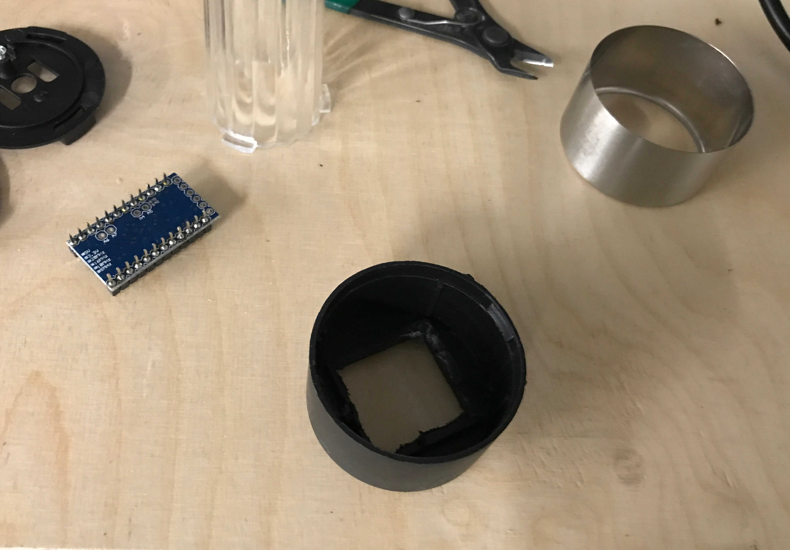
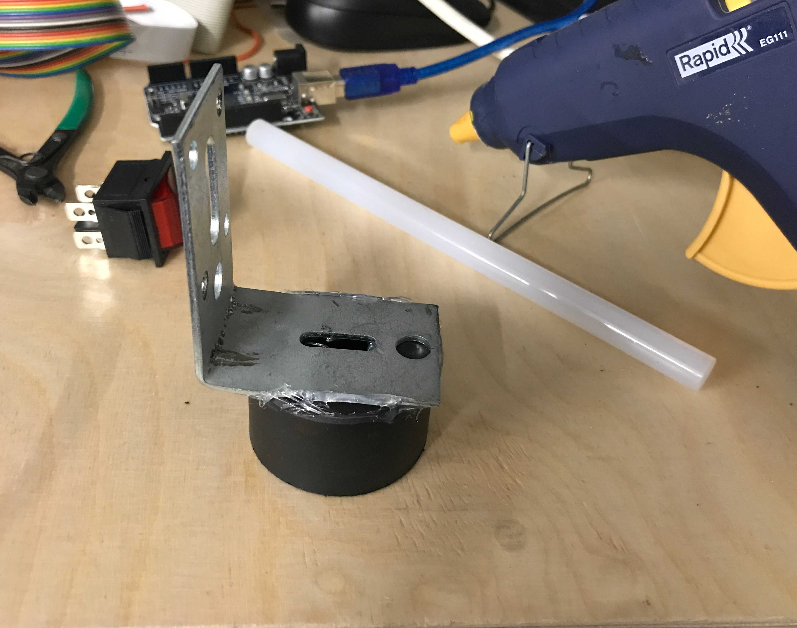
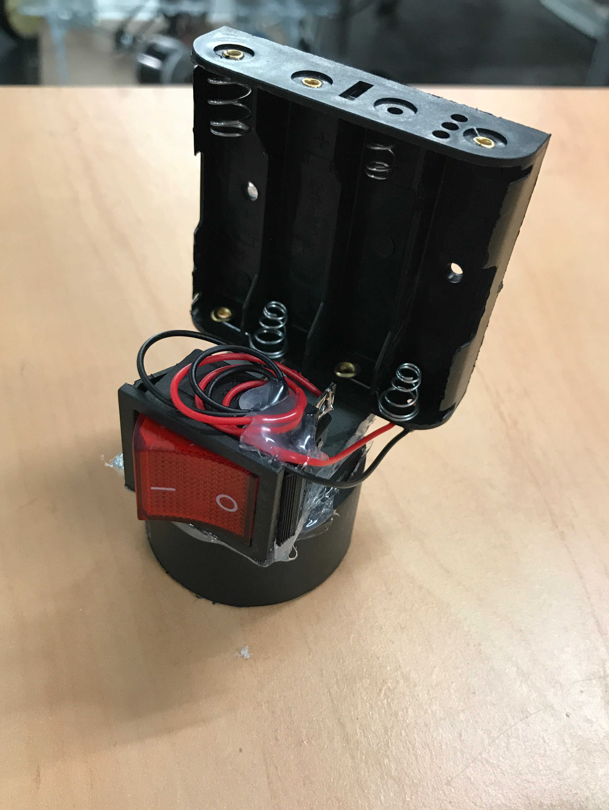

[Back to components README](../README.md)

# LEDs :bulb:

The LEDs are luminous landmarks used as beacon for locating the robot
by triangularisation.

## How it's made

A single luminous landmark is made from:
- 4 RGB LEDs.
- Plastic support taken from a [commercial solar beacons kit](https://www.leroymerlin.fr/v3/p/produits/balise-inox-inspire-e1500701586).
- An interruptor.
- A [metal square support](https://www.leroymerlin.fr/v3/p/produits/1-equerre-reglage-acier-zingue-hettich-l-70-mm-e1401288903).
- An Arduino pro mini.
- A battery support.

Here is how the different elements are linked:

To build the support:

- Open the commercial beacon:

- Remove the useless part:

- Glue it with the metal support:

- Glue the battery support and the interruptor:

The circuit is inside the plastic beacon part.

## Code on the Arduino card

The arduino card is flashed with the code from `leds.ino`.
This code lights up the leds with a random color.
The colors available are:
- red
- green
- blue
- yellow
- purple
- orange
- white

Depending on the quality of the leds the RGB values for these colors have
to be adjusted.

