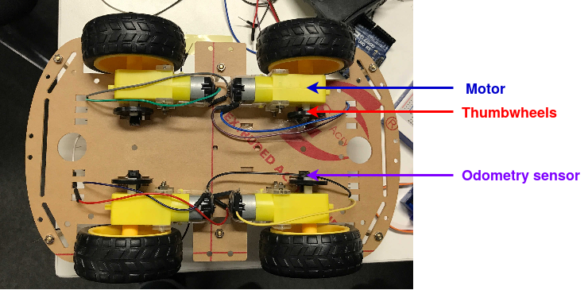

[Back to components README](../README.md)

# Odometry Sensor

The optical odometry sensors monitors the number of turns of each wheel.
This allows a greater precision for the robot moves and ease the location.

These sensors are below the robot to monitor the thumbwheels.

This is the picture of the bottom of the robot:

## Details

STM8S103F3 code for handling data coming from the odometry sensors.
It makes use of the several ports and external interrupt possibilities
to be able to track more than one sensor and reports the data through
its UART. Note that because the baud rate works through a frequency
divider and the code must work with software serial on the Arduino side,
the selected baud rate is 9600 and not 15200.
